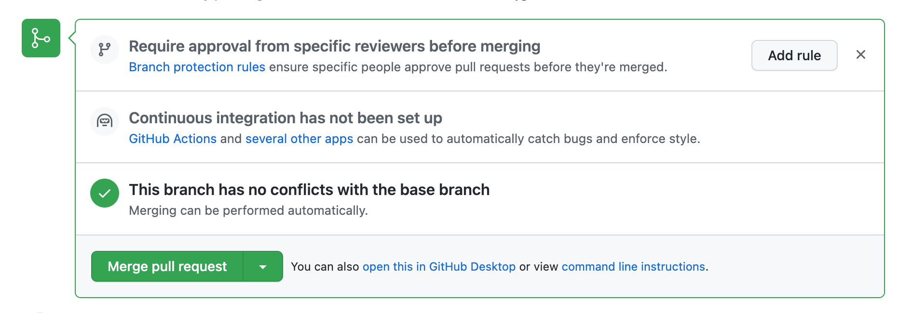

# github-demo

Hej vi lägger till första raden här och committar till main.


## instructions branch

Nu skapar vi en branch som heter instructions. 

```md
git checkout -b instructions
```

Detta kommando skapar en branch som heter instructions och därefter flyttar oss dit. Du kan kontrollera detta med hjälp av 

```md
git branch
```

I denna branchen kan du committa som vanligt. För att pusha upp till remote (github) använder du 

```md
git push origin instructions
```

Du kan också kolla på olika branches i github och där se att en knapp dykt upp där det står "Compare & pull request". 

## Pull request

Klicka på compare & pull request i github. Här kan du se source diff och rich diff för varje fil för att se förändringar. Skapa därefter pull request med en kommentar.

Alla collaborators ser en pull request i github och kan reviewa kod och diskutera koden. I bilden nedan ser du hur det kan se ut vid en diskussion. Här simulerar kokchun två personer, men det skulle lika gärna kunna vara två olika collaborators. 


Här nedan ser du om det går att mergea pull requesten. Kan även sätta upp regel för att en pull request ska bli accepterad. 



## Merge 

Efter merged pull request är det viktigt att varje person pull till main branch och pull till sin egna branch. 

Detta har jag lagt till från instructions-branch. 

Vi tar en merge från main till instructionsbranch för att lösa eventuella konflikter i instructionsbranchen

```md
git merge origin main
```

Välj om du ska acceptera current change, both changes, incoming changes.